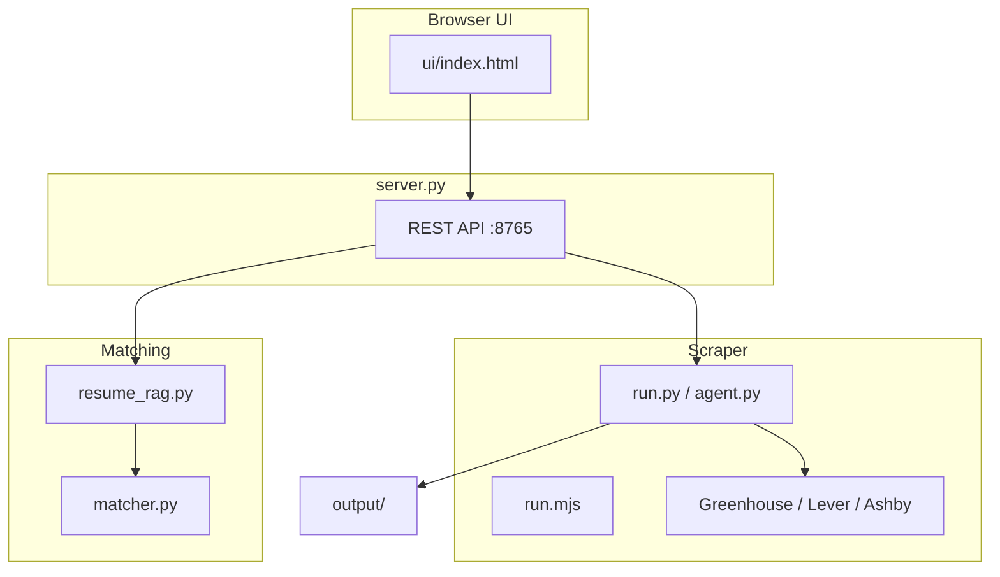

# PM Jobs Scraper & Job Agent

Scrape **director-and-above Product Management** roles from **100+ AI and tech companies** (Greenhouse, Lever, Ashby) in **India, Texas, and California** — then optionally **RAG-match** them against your resume in a local browser UI.

**Repository:** [github.com/bchandran75/pm-jobs-scraper](https://github.com/bchandran75/pm-jobs-scraper)

---

## Features

| Feature | Description |
|---------|-------------|
| **Live scrape** | Real ATS APIs — OpenAI, Anthropic, Perplexity, Stripe, Databricks, etc. |
| **Configurable companies** | `companies.json` — add/disable boards without code changes |
| **Configurable job titles** | `config/agent.json` — VP, Head of Product, CPO, … |
| **RAG resume match** | Chunks resume; retrieves relevant evidence per job |
| **Browser UI** | http://127.0.0.1:8765/ |
| **CLI + schedule** | `run.py`, `scrape.sh`, optional daily email via launchd |

---

## Quick start — Browser UI (recommended)

```bash
git clone https://github.com/bchandran75/pm-jobs-scraper.git
cd pm-jobs-scraper
pip install -r requirements.txt
python3 server.py
```

Open **http://127.0.0.1:8765/** in Chrome or Safari → **Setup** → **Scrape & RAG-match**.

One-liner on macOS:

```bash
./start-ui.sh
```

---

## Quick start — CLI only

**Node** (no Python venv):

```bash
./scrape.sh
# or: node run.mjs --category ai
```

**Python** (JSON + CSV + RAG):

```bash
python3 -m venv .venv && source .venv/bin/activate
pip install -r requirements.txt
python run.py --category ai --match --resume resume/resume.txt
```

---

## Architecture



**Batch path:** `launchd` → `scheduled-run.sh` → scrape → email digest.

Full detail: [docs/ARCHITECTURE.md](docs/ARCHITECTURE.md) · Agent/UI: [docs/AGENT.md](docs/AGENT.md)

---

## Configuration

| What | File |
|------|------|
| Companies (~105 boards) | [`companies.json`](companies.json) |
| Job titles, regions, RAG settings | [`config/agent.json`](config/agent.json) |
| Resume for RAG | [`resume/resume.txt`](resume/resume.txt) |
| SMTP / API keys | [`.env`](.env) from [`.env.example`](.env.example) |

```json
{
  "name": "Anthropic",
  "ats": "greenhouse",
  "board_id": "anthropic",
  "category": "ai"
}
```

Priority AI companies at the top of `companies.json` include **OpenAI** (Ashby), **Anthropic** (Greenhouse), **Perplexity** (Ashby). Some entries (e.g. NVIDIA) use `enabled: false` when no public API slug exists.

Reference: [docs/CONFIGURATION.md](docs/CONFIGURATION.md)

---

## CLI options

```bash
python run.py --category ai|tech|all
python run.py --match --resume resume/resume.txt
python run.py --no-llm              # faster RAG, no Claude
python run.py --workers 20
python run.py --no-save
```

---

## Optional: daily email (macOS)

```bash
cp .env.example .env   # add Yahoo app password
./scripts/install-schedule.sh
```

---

## Security

- Never commit `.env` (SMTP, `GITHUB_TOKEN`, `ANTHROPIC_API_KEY`)
- `output/` and `logs/` are gitignored — may contain personal job-search data

---

## Documentation

| Doc | Contents |
|-----|----------|
| [docs/AGENT.md](docs/AGENT.md) | Browser UI, API, RAG, job-title config |
| [docs/ARCHITECTURE.md](docs/ARCHITECTURE.md) | Scraper modules, ATS APIs |
| [docs/CONFIGURATION.md](docs/CONFIGURATION.md) | Env vars, companies.json |
| [docs/OPERATIONS.md](docs/OPERATIONS.md) | Schedule, logs |
| [docs/TROUBLESHOOTING.md](docs/TROUBLESHOOTING.md) | UI, speed, connection errors |

---

## Project layout

```
pm-jobs-scraper/
├── server.py              # Agent API + serves ui/index.html
├── start-ui.sh            # Start server + open browser
├── companies.json         # Company boards (shared)
├── config/agent.json      # Job titles, regions, agent settings
├── resume/resume.txt      # Resume for RAG
├── ui/
│   ├── index.html         # Browser UI (use this)
│   └── pm_job_agent.jsx   # Optional Cursor/React UI
├── run.py / run.mjs       # CLI scrapers
├── src/pm_jobs_scraper/
│   ├── agent.py           # Scrape orchestration
│   ├── search_criteria.py # Configurable title/region filters
│   ├── resume_rag.py      # TF-IDF RAG index
│   ├── matcher.py         # Score jobs vs resume
│   ├── filters.py         # Senior PM regex
│   └── scrapers/          # Greenhouse, Lever, Ashby
├── scripts/               # Email, schedule, GitHub push
└── docs/
```

---

## Limitations

- Only **Greenhouse, Lever, Ashby** with valid public `board_id`
- No LinkedIn, Indeed, or Workday-only career sites (e.g. some NVIDIA listings)
- Node vs Python filters differ slightly on region detection
- LLM refine requires `ANTHROPIC_API_KEY` and adds latency

---

## License

Personal job-search tooling. Use responsibly; respect company terms of service on career sites.
