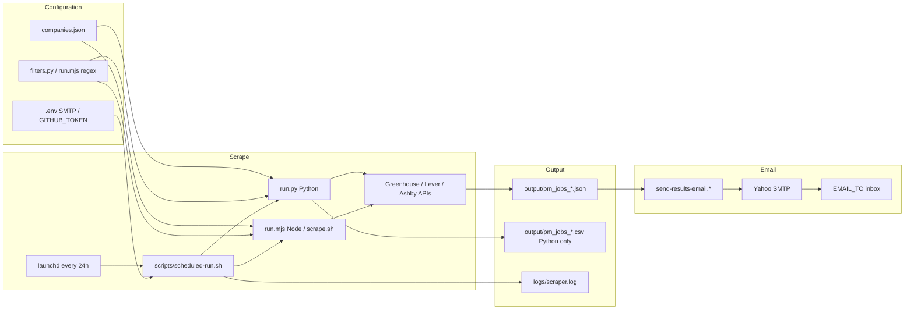

# PM Jobs Scraper

Automated job-search agent that scans **AI companies** and **leading tech companies** for **Product Management roles above Director level** in:

- **India** — Bangalore, Hyderabad, Mumbai, Delhi NCR, Pune, Chennai, remote-India, etc.
- **Texas** — Austin, Dallas, Houston, San Antonio, remote-TX, etc.
- **California** — SF Bay Area, LA, San Diego, Silicon Valley, remote-CA, etc.

Data comes from public **ATS APIs** (Greenhouse, Lever, Ashby). No login or browser automation is required.

**Repository:** [github.com/bchandran75/pm-jobs-scraper](https://github.com/bchandran75/pm-jobs-scraper)

---

## Architecture



**Typical scheduled path:** `launchd` → `scheduled-run.sh` → scrape (Python if `.venv` exists, else Node) → write `output/` → email latest JSON via SMTP.

---

## Quick start

### Option A — Node (recommended)

Works without Python, Xcode CLI tools, or a virtualenv.

```bash
git clone https://github.com/bchandran75/pm-jobs-scraper.git
cd pm-jobs-scraper
chmod +x scrape.sh
./scrape.sh
# or: node run.mjs
```

Results print in the terminal and save to `output/pm_jobs_<timestamp>.json`.

### Option B — Python (full pipeline + CSV)

```bash
cd pm-jobs-scraper
python3 -m venv .venv && source .venv/bin/activate
pip install -r requirements.txt
python run.py
```

Exports both JSON and CSV under `output/`.

### CLI options

**Python:**

```bash
python run.py --category ai      # AI companies only
python run.py --category tech    # Big tech only
python run.py --no-save          # Terminal output only
python run.py -o ~/Desktop/jobs  # Custom output folder
python run.py --workers 12       # Parallel fetch workers (default: 12)
```

**Node** (`run.mjs` / `./scrape.sh`):

```bash
node run.mjs --category ai
node run.mjs -o ./output
```

---

## Configuration

| What | Where | Docs |
|------|--------|------|
| Company list (93 boards) | [`companies.json`](companies.json) | [CONFIGURATION.md](docs/CONFIGURATION.md) |
| Role & location rules (Python) | [`src/pm_jobs_scraper/filters.py`](src/pm_jobs_scraper/filters.py) | [CONFIGURATION.md](docs/CONFIGURATION.md) |
| Role & location rules (Node) | Inline in [`run.mjs`](run.mjs) | [ARCHITECTURE.md](docs/ARCHITECTURE.md) |
| SMTP & optional GitHub token | [`.env`](.env) (from [`.env.example`](.env.example)) | [CONFIGURATION.md](docs/CONFIGURATION.md) |

Edit **`companies.json`** to add, disable, or remove companies. Both runtimes read the same file. After changes, run `./scrape.sh` once to verify; the 24h schedule picks up changes automatically.

Example entry:

```json
{
  "name": "Stripe",
  "ats": "greenhouse",
  "board_id": "stripe",
  "category": "tech"
}
```

| Field | Values | Notes |
|-------|--------|-------|
| `name` | string | Display name in results |
| `ats` | `greenhouse`, `lever`, `ashby` | Board type |
| `board_id` | slug | From careers URL (see below) |
| `category` | `ai` or `tech` | For `--category` filter |
| `enabled` | `false` (optional) | Skip without deleting |

**Finding `board_id`:** open the company careers page:

- Greenhouse: `boards.greenhouse.io/{board_id}`
- Lever: `jobs.lever.co/{board_id}`
- Ashby: `jobs.ashbyhq.com/{board_id}`

---

## Role filter logic

**Included (examples):** VP/SVP/EVP Product, CPO, Head of Product, Senior Director of Product, GM Product (when title clearly indicates PM leadership).

**Excluded:** Non-senior Director, Principal/Group/Senior/Staff/Associate PM, IC product managers, interns, coordinators.

Python applies stricter “plain Director” handling in `filters.py`. Node uses equivalent regexes in `run.mjs` with slightly different edge-case behavior — see [ARCHITECTURE.md](docs/ARCHITECTURE.md).

---

## Email results (Yahoo SMTP)

After each scheduled run (and on manual send), results can be emailed to the address in `EMAIL_TO` (default in `.env.example`: `balaji.chandran@yahoo.com`).

### One-time setup

1. Yahoo Mail → **Account** → **Account security** → enable **2-step verification**
2. Generate an **app password** for “Other app”
3. Configure the project:

```bash
cp .env.example .env   # install-schedule.sh also creates .env if missing
npm install            # optional; enables nodemailer path
```

4. Edit `.env` — use placeholders only; never commit real passwords:

```
SMTP_USER=your_yahoo@yahoo.com
SMTP_PASS=your-16-char-app-password
EMAIL_FROM=your_yahoo@yahoo.com
EMAIL_TO=recipient@yahoo.com
```

### Test email

```bash
./scrape.sh
source .env
python3 scripts/send-results-email.py
# or: node scripts/send-results-email.mjs
```

Scrape and email in one step:

```bash
source .env && SEND_EMAIL=1 ./scrape.sh
```

The email includes an HTML summary (format varies by sender script) and attaches the latest `output/pm_jobs_*.json`.

---

## Automatic schedule (every 24 hours)

Uses macOS **launchd** (runs while you are logged in; survives reboots).

```bash
chmod +x scripts/*.sh scrape.sh
./scripts/install-schedule.sh
```

| Item | Location / value |
|------|------------------|
| Interval | Every **86400** seconds (24h), first run at load |
| Plist | `~/Library/LaunchAgents/com.pm-jobs-scraper.plist` |
| Runner | `scripts/scheduled-run.sh` |
| Scraper log | `logs/scraper.log` |
| launchd stdout/stderr | `logs/launchd.out.log`, `logs/launchd.err.log` |
| Results | `output/pm_jobs_*.json` |

**Status:** `launchctl print gui/$(id -u)/com.pm-jobs-scraper`

**Uninstall:** `./scripts/uninstall-schedule.sh`

**Fixed time daily (e.g. 8:00 AM):** edit the installed plist — replace `StartInterval` with `StartCalendarInterval` (`Hour` = 8, `Minute` = 0).

Details: [OPERATIONS.md](docs/OPERATIONS.md).

---

## Push to GitHub

The repo is intended to live at **https://github.com/bchandran75/pm-jobs-scraper**.

`scripts/push-to-github.sh` downloads a local `gh` CLI (into `.tools/`), creates the repo if needed, and uploads project files via the GitHub Contents API (no system `git` required).

```bash
# Optional: add to .env for non-interactive auth
GITHUB_TOKEN=ghp_your_personal_access_token

./scripts/push-to-github.sh
```

Skipped paths: `.env`, `output/`, `logs/`, `node_modules/`, `.venv/`, `.tools/`, `__pycache__/`.

---

## Security

- **`.env` is gitignored** — never commit SMTP passwords or `GITHUB_TOKEN`
- Use a **Yahoo app password**, not your account login password
- **Rotate** app passwords if exposed or when rotating credentials
- Scrape output in `output/` and logs may contain job URLs and titles; treat as personal data

---

## Push to GitHub

Repo target: **https://github.com/bchandran75/pm-jobs-scraper**

```bash
# 1. Create a token: https://github.com/settings/tokens → repo scope
# 2. Add to .env:  GITHUB_TOKEN=ghp_...
# 3. Push (no Xcode/git required):
./scripts/push-to-github.sh
```

Or log in once with device flow:

```bash
./.tools/gh/gh auth login --hostname github.com --device
./scripts/push-to-github.sh
```

`.env` is never uploaded (secrets stay local).

## Limitations

- Only companies on **Greenhouse, Lever, or Ashby** with correct public `board_id` values (~93 configured)
- Does **not** scrape LinkedIn, Indeed, or login-walled career sites
- Location matching depends on how each company tags jobs in the ATS
- Board slugs change; stale `board_id` entries return empty or 404 (silently skipped)
- Node and Python filters are **mostly aligned** but not identical (region may be inferred from title in Python only)
- Scheduled runs exit non-zero when **no matches** are found (scrape still completes; email may report zero roles)

---

## Documentation

| Document | Contents |
|----------|----------|
| [docs/ARCHITECTURE.md](docs/ARCHITECTURE.md) | Modules, data flow, ATS endpoints |
| [docs/CONFIGURATION.md](docs/CONFIGURATION.md) | Environment variables, `companies.json`, filters |
| [docs/OPERATIONS.md](docs/OPERATIONS.md) | Install, logs, troubleshooting, manual runs |

---

## Project layout

```
pm-jobs-scraper/
├── companies.json          # Shared company list
├── run.mjs / scrape.sh     # Node entry
├── run.py                  # Python CLI
├── src/pm_jobs_scraper/    # Python package (agent, filters, scrapers)
├── scripts/                # Schedule, email, GitHub push
├── launchd/                # Plist template
├── output/                 # Scrape results (gitignored)
└── logs/                   # Runtime logs (gitignored)
```
