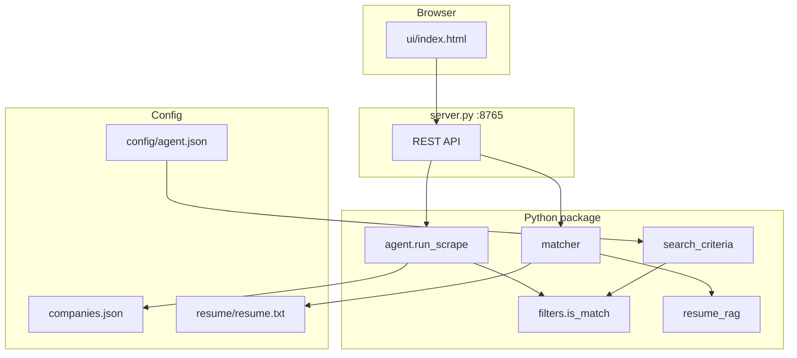

# PM Job Agent — Browser UI, API & RAG Matching

The **Job Agent** layers a local web UI and resume matching on top of the core scraper. It scrapes **real** postings from Greenhouse, Lever, and Ashby (no invented listings), then scores each role against your resume using **RAG** (retrieval-augmented generation).

---

## Quick start

```bash
cd pm-jobs-scraper
pip install -r requirements.txt    # once
python3 server.py                  # keep running
```

Open in **Chrome or Safari** (not `file://`):

**http://127.0.0.1:8765/**

Or:

```bash
./start-ui.sh    # starts server + opens browser on macOS
```

---

## Architecture



### Pipeline when you click **Scrape & RAG-match**

1. **Save** resume + optional companies list + search criteria to disk.
2. **Scrape** all enabled companies in `companies.json` (parallel HTTP, ~20 workers).
3. **Filter** each job by configurable **job titles**, **regions**, and senior PM rules.
4. **Match** survivors with RAG: chunk resume → TF-IDF retrieve top chunks per job → heuristic score (optional Claude refine).
5. **Return** JSON to the browser; optionally write `output/pm_jobs_*.json`.

Typical timing: **30–90s** for ~100 companies (category **AI only** ~40 boards, often **&lt;15s**).

---

## Configuration

### `config/agent.json`

| Field | Type | Description |
|-------|------|-------------|
| `candidateName` | string | Used in match summaries |
| `jobTitles` | string[] | Phrases matched in job title (case-insensitive substring) |
| `regions` | string[] | `india`, `texas`, `california` |
| `requireSeniorPmRules` | boolean | If true, also apply built-in VP/Director+ PM regex rules |
| `fetchDescriptions` | boolean | If true, Greenhouse fetches full HTML (slower). Default `false` |
| `useLlmMatch` | boolean \| null | Optional Claude refine when `ANTHROPIC_API_KEY` is set |
| `apiBaseUrl` | string | Hint for UI (default `http://127.0.0.1:8765`) |

Example:

```json
{
  "candidateName": "Your Name",
  "jobTitles": [
    "VP of Product",
    "Head of Product",
    "Director of Product",
    "CPO"
  ],
  "regions": ["india", "texas", "california"],
  "requireSeniorPmRules": true,
  "fetchDescriptions": false
}
```

### `resume/resume.txt`

Plain-text resume. The RAG index chunks this file (~450 chars with overlap) and retrieves the most relevant sections per job.

### `companies.json`

Same file as the batch scraper. Edit in the UI or on disk. Set `"enabled": false` to skip a board without deleting it.

**ATS note:** OpenAI and Perplexity use **Ashby**; Anthropic uses **Greenhouse**. Wrong `ats` + `board_id` returns zero jobs.

---

## REST API

Base URL: `http://127.0.0.1:8765`

| Method | Path | Description |
|--------|------|-------------|
| GET | `/` | Browser UI (`ui/index.html`) |
| GET | `/api/health` | `{"ok": true, "version": 2}` |
| GET | `/api/config` | Agent config + search criteria |
| PUT | `/api/config` | Merge and save `config/agent.json` |
| GET | `/api/resume` | Current resume text |
| PUT | `/api/resume` | Save resume |
| GET | `/api/companies` | Full `companies.json` array |
| PUT | `/api/companies` | Replace `companies.json` |
| POST | `/api/run` | Scrape + RAG match (see body below) |

### POST `/api/run` body

```json
{
  "category": "all",
  "resume": "optional override text",
  "candidateName": "Balaji Chandran",
  "jobTitles": ["VP of Product", "Head of Product"],
  "regions": ["india", "california"],
  "requireSeniorPmRules": true,
  "fetchDescriptions": false,
  "useLlm": false,
  "fast": true,
  "workers": 20
}
```

### Response (excerpt)

```json
{
  "jobs": [
    {
      "company": "Databricks",
      "title": "Senior Director, Product Management",
      "location": "San Francisco, California",
      "region": "california",
      "url": "https://...",
      "matchScore": 67,
      "matchTier": "good",
      "summary": "...",
      "strengths": ["..."],
      "gaps": ["..."],
      "resumeEvidence": ["..."]
    }
  ],
  "timing": {
    "scrapeSeconds": 45.2,
    "matchSeconds": 1.1,
    "totalSeconds": 46.3
  }
}
```

---

## CLI (no browser)

```bash
PYTHONPATH=src python3 run.py --category ai --match --resume resume/resume.txt
```

| Flag | Purpose |
|------|---------|
| `--match` | RAG score after scrape |
| `--resume PATH` | Resume file |
| `--no-llm` | Heuristic RAG only |
| `--category ai\|tech\|all` | Limit companies |
| `--workers N` | Parallel fetches |

Optional `.env`:

```
ANTHROPIC_API_KEY=sk-ant-...
CANDIDATE_NAME=Your Name
AGENT_PORT=8765
```

---

## Python modules (agent-specific)

| Module | Role |
|--------|------|
| `server.py` | HTTP server + API routes |
| `search_criteria.py` | Load `agent.json`; title/region matching |
| `resume_rag.py` | TF-IDF chunk index + retrieval |
| `matcher.py` | Heuristic + optional LLM scoring |
| `filters.py` | Senior PM regex; calls `search_criteria` |
| `agent.py` | Scrape orchestration + save |

---

## React artifact (optional)

`ui/pm_job_agent.jsx` is a Cursor/React version of the same flow. It requires the same API at `http://127.0.0.1:8765`. Prefer **`ui/index.html`** for normal browser use.

---

## Troubleshooting

| Symptom | Fix |
|---------|-----|
| `ERR_CONNECTION_REFUSED` | Run `python3 server.py` |
| Yellow “Cannot reach API” | Same; use `http://127.0.0.1:8765/` not `file://` |
| Error `not found` on scrape | Restart server (old process missing `PUT /api/config`) |
| Very slow run | Category **AI only**; uncheck **LLM refine**; keep `fetchDescriptions: false` |
| Zero jobs | Relax `jobTitles`; check `regions`; verify `board_id` in `companies.json` |

See [TROUBLESHOOTING.md](TROUBLESHOOTING.md) for more.
