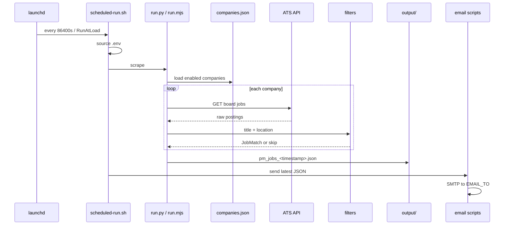

# Architecture

This document describes how the PM Jobs Scraper is structured, how data flows through the system, and how each ATS integration works.

## Goals

1. Fetch all public job postings from configured company boards (Greenhouse, Lever, Ashby).
2. Filter to **director-and-above Product Management** roles in **India, Texas, or California**.
3. Persist matches to `output/` and optionally email a digest.

Two runtimes implement the same high-level pipeline:

| Runtime | Entry | Parallelism | Output |
|---------|--------|-------------|--------|
| **Node** | `run.mjs` via `scrape.sh` | `Promise.all` per company | JSON only |
| **Python** | `run.py` | `ThreadPoolExecutor` (default 12 workers) | JSON + CSV |

The scheduled job (`scripts/scheduled-run.sh`) prefers **Python** when `.venv/bin/python` exists; otherwise it runs **Node** via `scrape.sh`.

---

## Data flow



### Deduplication

Both runtimes deduplicate by **job URL** before saving or printing.

### Exit codes

- **Node:** exits `1` when zero matches (still writes nothing in that case — no file if empty).
- **Python:** `run.py` returns `1` when no matches; returns `0` when matches exist.
- **scheduled-run.sh:** propagates scrape exit code; email failures are logged but do not always fail the job.

---

## Module map (Python)

```
src/pm_jobs_scraper/
├── companies.py         # Load companies.json → Company dataclass
├── filters.py           # Title seniority + geo regex → JobMatch
├── search_criteria.py   # Configurable jobTitles + regions (agent.json)
├── resume_rag.py        # TF-IDF chunk index over resume
├── matcher.py           # RAG + heuristic (+ optional LLM) scoring
├── agent.py             # Orchestration, Rich UI, save JSON/CSV
└── scrapers/
    ├── greenhouse.py
    ├── lever.py
    └── ashby.py

server.py                  # HTTP API + browser UI at :8765
ui/index.html              # Browser front-end
config/agent.json          # Job titles, regions, agent settings
```

| Module | Responsibility |
|--------|----------------|
| `companies.py` | Parses `companies.json`; skips `enabled: false` |
| `filters.py` | `matches_pm_senior()`, `detect_region()`, `is_match()` |
| `agent.py` | `run_scrape()`, `print_results()`, `save_results()` |
| `scrapers/*.py` | HTTP GET + map API fields → `is_match()` |

`run.py` is a thin CLI: argparse → `run_scrape()` → print/save.

---

## Node implementation

`run.mjs` is self-contained:

- Loads `companies.json` at startup (filters `enabled !== false`).
- Embeds the same regex families as Python for PM title, seniority, exclusions, and regions.
- Fetches boards concurrently with `Promise.all`.
- On `SEND_EMAIL=1`, spawns `scripts/send-results-email.mjs` after a successful save.

**Filter difference vs Python:** Python runs `detect_region()` on `location + title`; Node only tests **location** for region. Python also rejects plain “Director” unless combined with VP/CPO/Head signals or “Senior/Executive Director”.

---

## ATS APIs

All endpoints are **unauthenticated** public job-board APIs.

### Greenhouse

| | |
|--|--|
| **URL** | `https://boards-api.greenhouse.io/v1/boards/{board_id}/jobs` |
| **Python** | `src/pm_jobs_scraper/scrapers/greenhouse.py` |
| **Node** | `GREENHOUSE` constant in `run.mjs` |
| **Title field** | `job.title` |
| **Location** | `job.location.name` or joined `job.offices[].name` |
| **Link** | `job.absolute_url` |
| **404** | Empty list (board missing or slug wrong) |

Python uses `content=true` only when `fetchDescriptions` is enabled in `config/agent.json` (default `false` for speed). Node uses default response without full descriptions.

### Lever

| | |
|--|--|
| **URL** | `https://api.lever.co/v0/postings/{board_id}?mode=json` |
| **Title field** | `job.text` |
| **Location** | `job.categories.location` or `job.allLocations` |
| **Link** | `job.hostedUrl` or `job.applyUrl` |
| **Response** | JSON array of postings |

### Ashby

| | |
|--|--|
| **URL** | `https://api.ashbyhq.com/posting-api/job-board/{board_id}` |
| **Title field** | `job.title` |
| **Location** | `job.location` or `"Remote"` if `job.isRemote` |
| **Link** | `job.jobUrl` or `job.applyUrl` |
| **Errors** | Python treats 403/404 as empty; Node treats non-OK as throw (caught per company) |

### HTTP client behavior

| | Python | Node |
|--|--------|------|
| Library | `httpx` | `fetch` |
| Timeout | 30s total, 10s connect | default |
| User-Agent | `pm-jobs-scraper/0.1 (...)` | `pm-jobs-scraper/0.1` |
| Per-company errors | Counted in `ScrapeStats.errors` | Swallowed (empty result) |

---

## Output schema

Written to `output/pm_jobs_<timestamp>.json`:

```json
{
  "scraped_at": "2026-05-17T12:00:00.000Z",
  "count": 2,
  "filters": { },
  "jobs": [
    {
      "company": "Example Corp",
      "category": "tech",
      "title": "VP Product",
      "location": "San Francisco, CA",
      "region": "california",
      "url": "https://...",
      "ats": "greenhouse"
    }
  ]
}
```

- **`filters`** metadata object is included by Python only.
- Timestamp format differs: Python uses `YYYYMMDD_HHMMSS` (UTC); Node uses ISO-like strings with `-` instead of `:` in the filename.

Python also writes a **CSV** with columns: `company`, `category`, `title`, `location`, `region`, `url`, `ats`.

---

## Email subsystem

After scraping, `scheduled-run.sh` calls `send_email()` which tries, in order:

1. `scripts/send-results-email.sh` (curl SMTP)
2. `.venv/bin/python scripts/send-results-email.py`
3. `python3 scripts/send-results-email.py`
4. `node scripts/send-results-email-smtp.mjs` (raw SMTP, no npm)
5. `node scripts/send-results-email.mjs` (nodemailer, requires `npm install`)

All readers pick the **newest** `output/pm_jobs_*.json` by modification time.

Manual one-off: `SEND_EMAIL=1 ./scrape.sh` triggers nodemailer path from `run.mjs` only.

---

## Scheduling

| File | Role |
|------|------|
| `launchd/com.pm-jobs-scraper.plist.template` | Template with `__PROJECT_DIR__` placeholder |
| `scripts/install-schedule.sh` | Substitutes path, bootstraps LaunchAgent, runs `npm install`, seeds `.env` |
| `scripts/scheduled-run.sh` | Scrape + email + `logs/scraper.log` |
| `scripts/uninstall-schedule.sh` | Bootout + remove plist |

`StartInterval` = 86400 seconds; `RunAtLoad` = true.

---

## GitHub upload (optional)

`scripts/push-to-github.sh` is separate from scraping: bundles files via GitHub API using a locally installed `gh` binary. Not part of the scrape/email loop.

---

## Extension points

| Change | Touch |
|--------|--------|
| Add company | `companies.json` only |
| New ATS vendor | New scraper module + `FETCHERS` / `run.mjs` branch |
| Loosen/tighten roles | `filters.py` and `run.mjs` regexes (keep in sync manually) |
| New region | `INDIA_RE` / `TEXAS_RE` / `CALIFORNIA_RE` in both runtimes |
| Email template | `scripts/send-results-email.*` |
